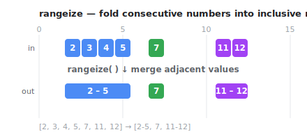

# rangeize

> `[1,2,3,4,5] => [1,5]` Convert sequential numbers to ranges.



## Install

```sh
npm install rangeize
```

## Usage

```ts
import { rangeize } from "rangeize"

rangeize([2, 3, 4, 5, 7, 11, 12])
// [
//   { start: 2, end: 5 },
//   { start: 7, end: 7 },
//   { start: 11, end: 12 },
// ]
```

Pass a custom adjacency rule when consecutive values follow a different rule:

```ts
rangeize([1, 2, 4, 10, 12], (left, right) => right - left <= 2)
// [
//   { start: 1, end: 4 },
//   { start: 10, end: 12 },
// ]
```

Input order is preserved. Sort the input first when numeric ordering is required.

### Notes

- A span's `end` is always the latest value that the adjacency rule absorbed. The
  default rule (`left + 1 === right`) only merges strictly increasing values, so
  spans stay well-formed (`start <= end`). A custom rule that accepts a smaller
  `right` than `left` on unsorted input can produce an inverted span
  (`start > end`) — keep the rule monotonic, i.e. only return `true` when
  `left < right`.
- Duplicate values are not adjacent under the default rule, so they split into
  separate spans: `rangeize([1, 1, 2])` → `[{ start: 1, end: 1 }, { start: 1, end: 2 }]`.

## License

MIT © [elzup](https://github.com/elzup)
